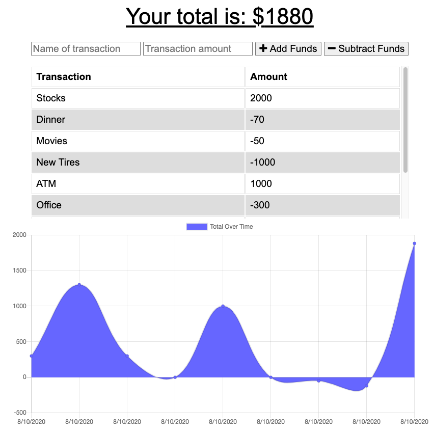

# Budget-Tracker

## Table of Contents

- [Description](#description)
- [Installation](#install)
- [Usage](#usage)
- [Licences](#licences)
- [Questions](#questions)

## Description

A budget tracker that allows the user to keep track of their expenses and being able to use the application online/offline. 

## Install

* Git Clone https://github.com/chaseyb/Budget-Tracker.git
* Setup MongoDB on local Machine
* Run mongod to instantiate in perfered CLI (leave running)
* Nagivate to the root folder of this repo and run npm install
* To start application run node server
* This application runs on localhost port 3000

## Usage

The user will be able to add expenses and deposits to their budget with or without a connection. When entering transactions offline, they should populate the total when brought back online.

## Licences

## Heroku Demo

 [Heroku link](https://budget-tracker-9000.herokuapp.com/ "Heroku Link")

## Questions?

- [Chaseyb](https://github.com/Chaseyb)
- <Chase.b.johnson@gmail.com>

  
